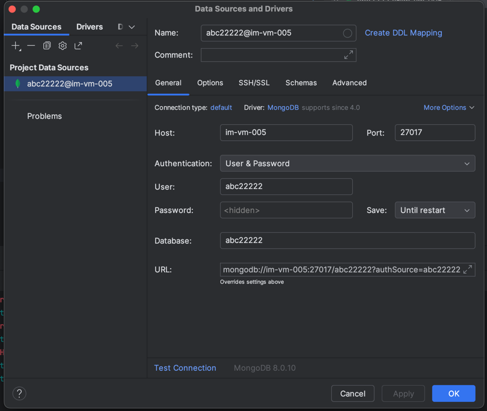

# AGWI Beispielprojekt

Stand 12.06.2025

## Mögliche Fehlermeldung "Cannot find reference 'ObjectId' in imported module bson"

Falls Sie die Fehlermeldung "Cannot find reference 'ObjectId' in imported module bson" bekommen müssen Sie in der 
Konsole (Icon *>_* bzw. *Terminal* in PyCharm unten links) folgende drei Befehle ausführen:

```
pip uninstall bson
pip uninstall pymongo
pip install pymongo
```

## Session

Eine Session in Webanwendungen ist ein temporärer Speicherbereich, der es ermöglicht, Benutzerdaten
(das heißt des selben Browser-Fensters) über mehrere HTTP-Anfragen hinweg zu speichern.
Zum Beispiel, ob ein Nutzer eingeloggt ist oder welche Artikel im Warenkorb liegen.

### Technische Voraussetzungen

In der Webanwendung gibt es dazu eine Dictionary-Variable namens `session`.
Diese ist mit einem zusätzlichen `from flask import session` verfügbar.
Außerdem muss eine Variable `app.secret_key` außerhalb der Methodendefinitionen mit einem String als "Passwort"
gesetzt werden. Mit diesem *secret_key* werden die Session-Daten von Flask verschlüsselt.

### Beispiele

Im Python-Code kann Sie zum Lesen und Schreiben wie folgt genutzt werden:

```python
session['key'] = value   # Value der Session unter dem key hinzufügen...
value_ = session['key']  # ...und an anderer Stelle wieder lesen; alternative Syntax: value_ = session.get('key')
```

Diese Variable ist ebenfalls in den Templates verfügbar und nutzbar.

Beispiel für die Nutzung von `session` im Beispiel:
- In [app.py](app.py) (Zeile 67) 
  ```python
  session["eingeloggter_user"] = user_from_db
  ```
- In [start.html](start.html) (Zeilen 8 - 10)
  ```html
  
    <p>Du bis eingeloggt als {{ session.get("eingeloggter_user").username }}.</p>
  
  ```

## Datenbankanbindung und neues Repository

### Repository 

Das bisherige Repository [repository.py](repository.py) wird nicht mehr verwendet.
Es wurde durch die generische Klasse `Repository[T]` aus [repository_db.py](repository_db.py) ersetzt.

Von dieser Klasse wird für jede *Dataclass* (Geschäftsobjekte aus [entity.py](entity.py)) ein
Repository-Objekt angelegt, zum Beispiel allgemein oben in der [app.py](app.py):

```python
user_repo    = Repository[User](db["users"], User, primary_key="username")
product_repo = Repository[Product](db["products"], Product, primary_key="product_id")
```

Parameter:
- `db["users"]`: Legt die *Collection* in der Datenbank für die einzelnen Dokumente fest
- `User`: Wiederholt den Datentyp, der für dieses Repository gesetzt wurde
- `primary_key=username`: Gibt des Namen des Attributs des *Primärschlüssels* an (diese Attributwerte definieren ein Objekt eindeutig)

Repository-Methoden am Beispiel des `product_repo`:
- `product_repo.save(produkt_objekt)`: Speichert ein neues Produkt
- `product = product_repo.find_by_id(4711)`: Lädt das Produkt mit der `product_id` 4711 
- `products = product_repo.find_all()`: Lädt alle Produkte als Liste `products`
- `products = product_repo.find({"title" : "Jeans"})`: Lädt alle Produkte mit dem Titel `Jeans`
- Bei den `find_all()` und `find()` können optional noch die Argument `skip=x` und `limit=y` gesetzt werden,
  dadurch werden die ersten `x` Produkte ausgelassen und anschließend nur `y` Produkte geladen
- `product_repo.delete_by_id(4711)`: Löscht das Produkt mit der `product_id`4711
- `product_repo.update_by_id(4711, neues_produkt_objekt)`: ersetzt das bestehende Produkt durch das neue

Zu Speichern und Lesen, auch mit Abfragebedingungen und Skip/Limit, finden Sie Beispiele in diesem Projekt.

### Datenbank

Für die Klasse `Repository[T]` ist eine aktive Datenbankverbindung notwendig.

Hierfür wurde für alle AGWI-Studierenden eine persönliche Datenbank auf einem Laborserver eingerichtet.
Die Zugangsdaten dazu lauten allgemein:

- Username: Ihr NDS-Account-Kürzel (z. B. `abc22222`)
- Passwort: Standardmäßig der Username mit Zusatz `_secret` (z. B. `abc22222_secret`)
- Datenbankname: Ihr NDS-Account-Kürzel (z. B. `abc22222`)

In [app.py](app.py) erfolgt die Verbindung zur Datenbank über die Klasse `MongoClient` mit den entsprechenden
Parameter (siehe Zeile 15 ff.). Bitte ersetzen Sie das `abc22222` dort durch Ihr NDS-Account-Kürzel.

> **Wichtige Hinweise:**
> - Die Datenbank ist nur aus dem Netzwerk der OTH erreichbar. **Es ist deshalb immer eine aktive VPN-Verbindung notwendig!***
> - Die Datenbank steht nur für Lehrzwecke bis zum Ende des Semesters zur Verfügung.
> - Speichern Sie keine personenbezogen Daten, sondern nur Testdaten.
> - Mit Ausfällen und Datenverlust ist zu rechnen.

Falls Sie Daten in der Datenbank direkt einsehen, ändern oder löschen möchten, können Sie einen Datenbank-GUI-Client verwenden.
*PyCharm* stellt dazu eine sehr einfaches Tool zur Verfügung (wie in der Vorlesung eingerichtet).
Die Verbindungsparameter dazu lauten (bitte durch Ihre Zugangsdaten oben ersetzen): 




## Dataclasses, Repositories, Listen und Dictionaries (Maps); Bootstrap

Für die *Geschäftsobjekte* bzw. allgemeiner *Entites* (hier *User* und *Product*, siehe erster Meilenstein)
werden Python-Klassen definiert (objektorientierte Programmierung). Diese Klassendefinitionen wurden in einer eigenen Datei 
[entity.py](entity.py) vorgenommen. Somit können sie leicht in anderen Python-Dateien mit 
`from entity import User, Product` importiert werden.
Mit der Annotation `@dataclass` werden automatisch zusätzliche Methoden wie der Konstruktor (`__init__()` in Python), 
toString (`__repr__()`), equals (`__eq__()`) usw. generiert.

Mit der zusätzlichen Annotation `@dataclass_json` erhält eine *dataclass* zusätzlich noch eine Methode `to_json()` und 
und eine statische Methode `from_json(JSON-str)`. Diese sind nicht direkt in Ihrem Code wichtig, werden aber für den
Datenbank-Zugriff benötigt (da die Datenbank mit JSON-Objekten kommuniziert und diese somit automatisch erzeugt werden 
können). Diese beiden Methoden werden allerdings nicht in PyCharm in der Codevervollständigung angezeigt (stehen aber 
zur Laufzeit zur Verfügung); um dies auch in PyCharm zu sehen, können die Entity-Klassen von der Klasse 
`DataClassJsonMixin` erben, siehe auskommentierte Klassen in [entity.py](entity.py).

Ein *Repository* ist für Kapselung des Zugriffs auf die Datenbank verantwortlich und stellt üblicherweise Methoden zum
Schreiben, Lesen, Ändern und Löschen zur Verfügung. In diesem Beispiel wurde ein generisches Repository umgesetzt,
das für alle Arten von *Entities* genutzt werden kann. Diese wurde ebenfalls wieder in einer eigenen Python-Datei 
[repository.py](`repository.py`) implementiert und kann in [app.py](`app.py`) und anderen importiert werden.

Dieses Repository bietet derzeit noch keinen Datenbankzugriff ab. Die Entity-Objekte werden lediglich in einem
Dictionary namens `datenbank` abgelegt. Der Datentyp dieses Dictionaries ist `dict[str, dict[primary_key, entity]]`.

> **Hinweis:** In der Gruppe um 8:15 Uhr wurde diese Variante noch nicht besprochen.
> Hier wurden die Methoden für jedes Geschäftsobjekt einzeln angelegt (siehe Methodennamen)
> und für jedes Geschäftsobjekt wurde ein eigenes Dictionary angelegt.
> Diese wurden nun in dieser Version in einem übergeordneten Dictionary zusammengefasst,
> und man kann den Entity-Typen als String angeben.
> 
> Beispiel für Nutzung des Repositories über `users`
> ```python
> 
> from repository import save, find_by_id, find_all
> user = User("john", "secret")
> save("users", user.username, user)
>
> user_from_repo = find_by_id("users", "john")
> ```

Die Startseite in diesem Beispiel ist weiterhin häßlich. Allerdings wurde für die Produktübersichtsseite
und die Produktdetailseite Features von Bootstrap benutzt. Dazu wurde auch die Definition der Entity-Klassen etwas 
angepasst:
- das URL-Feld ist jetzt eine Liste an URLs `pic_urls: list[str]` und wird für ein *Carousel* im Template 
  [product_details.html](templates/produkt_details.html) genutzt
- als Beispiel für die Definition und Verwendung einer Enumeration wurde die Klasse `class Size(Enum):` eingeführt;
  eine mögliche Verwendung als Attribut ist in der *dataclass* `Product` als Kommentar vorhanden
- Das [Repository](repository.py) legt für die Produkte bereits zwei Dummy-Objekte an, diese werden später
  händisch in die Datenbank eingetragen.

## Cascading Style Sheets (CSS)

Mit Hilfe der erstellten [css-Datei](static/css/style.css) werden Layout-Informationen (Farben, Schrift, Rahmen, Position, ...)
den Elementen in HTML zugeordnet.

Grundsätzlich im Format `<SELECTOR> { <PROPERTY>:<VALUE>; ... }` mit folgenden drei genutzten *Selektoren* (Beispiele):
- `h1 { color:rgb(30,45,129); backgroud-color:blue; font-family:Arial; }` --> legt das Layout für alle `<h1>`-Elemente fest
- `#xyz { ... }` --> legt das Layout für das Element `<div id="xyz">...</div>` fest (und für die enthaltenen Unter-Elemente)
- `.abc { ... }` --> legt das Layout für Elemente fest, die der Klasse `abc` zugeordnet werden, z. B. `<p class="abc">`

## Frontend-Toolkit 'Bootstrap'

Das Frontend-Toolkit [Bootstrap](https://www.getbootstrap.com) definiert ein eine große Menge an CSS-Klassen und gibt viele Beispiele, 
wie diese genutzt werden können. Die HTML-Beispiele in [Docs](https://getbootstrap.com/docs/5.3/getting-started/introduction/)
wie *Tables*, *Forms*, *Cards* u. v. m. können einfach für die eigenen HTML-Templates genutzt und angepasst werden.

Einzige Voraussetzung ist, dass die CSS-Datei von Bootstrap im HTML-Header des eigenen HTML-Templates eingebunden wurde.
Dies geschieht mit dem Element `<link rel="stylesheet" href="...">` im HTML-Element `<head>`.
In diesem Beispielprojekt z. B. in [base.html](templates/base.html) zu finden.

## Template-Engine

Mit `from flask import render_template` kann die Methode `render_template("mein_template.html", ...)` genutzt werden.
Hierfür werden HTML-Dateien im Ordner [/templates](templates) als Templates erstellt, deren Inhalt dann von der Methode
geladen und zurückgegeben wird.

Für variable Anteile im Template werden diese mit `{{ variablen_name }}` definiert.
Fallunterscheidungen und Wiederholungen (Schleifen) sind im Template ebenfalls möglich mit `...` 
und `...`. Siehe dazu die Beispiele in den Templates!

## Besprochene HTML-Elemente

```html
<a href=""></a>

<form action="">...
   <input ...>
   <label ...>
</form>

<h1>, <h2>, ...
<p>

<ul> <li></li> ... </ul>
<ol> <li></li> ... </ol>

```

## Besprochene Python- und Flask-Features

- Templates mit render_template()-Methode
- Methodendefinition mit `def` und Routendefinition (Link) zur Methode mit `@app.route`
- Variablen, Listen, Maps
- foreach-Schleife `for ... in ...`
- Strings `+= f".....{var}..."` und Multi-Line-Strings mit `""" ... """`
- Variable Pfadinformationen mit `@app.route(".../<var>")` und `def methode(var)`
- Formulardaten und Variable `request.form.get("input_name")`
- ...